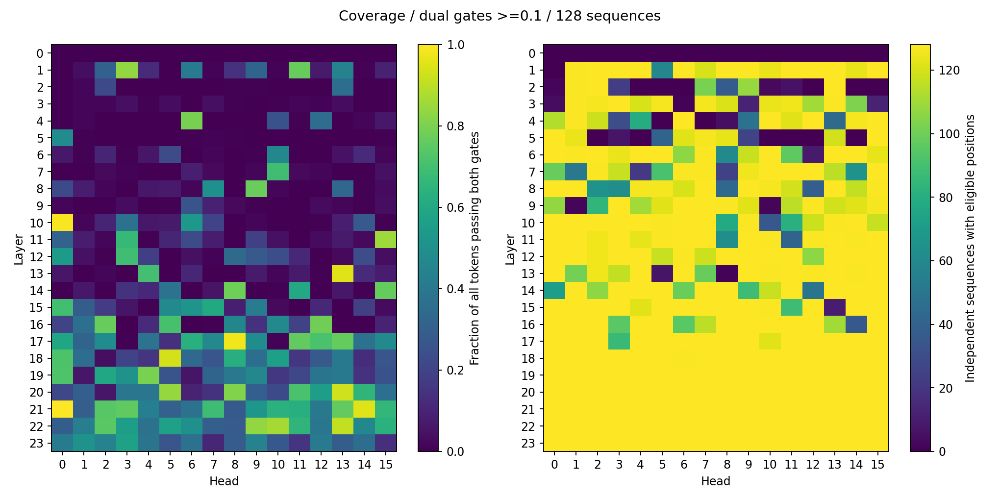
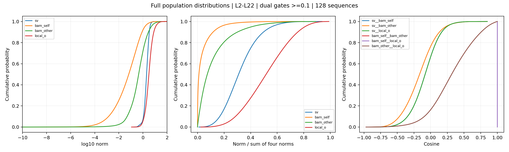
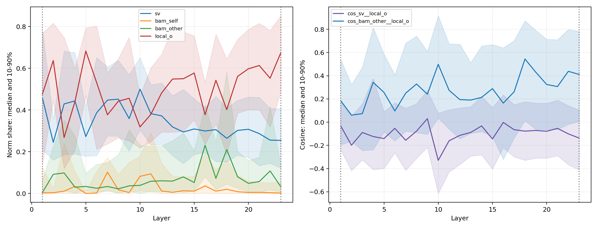
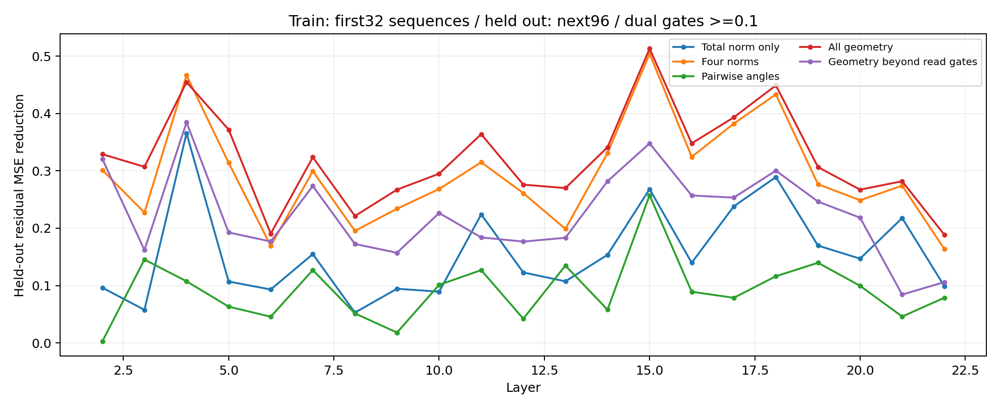
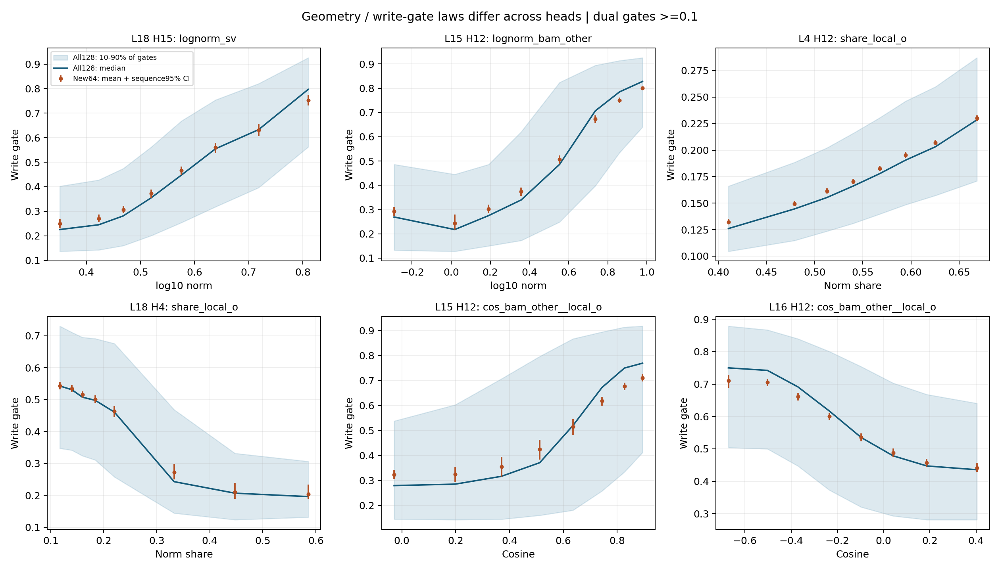
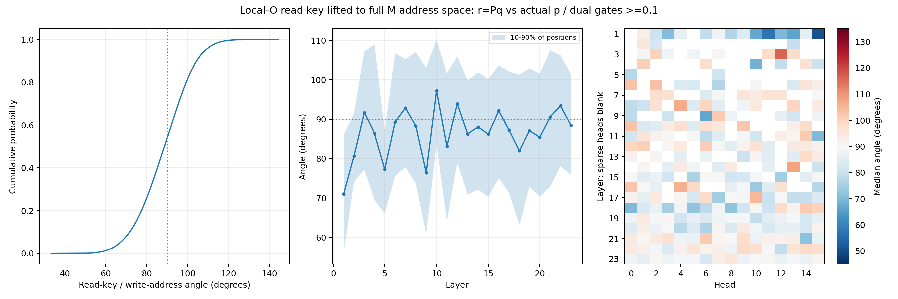
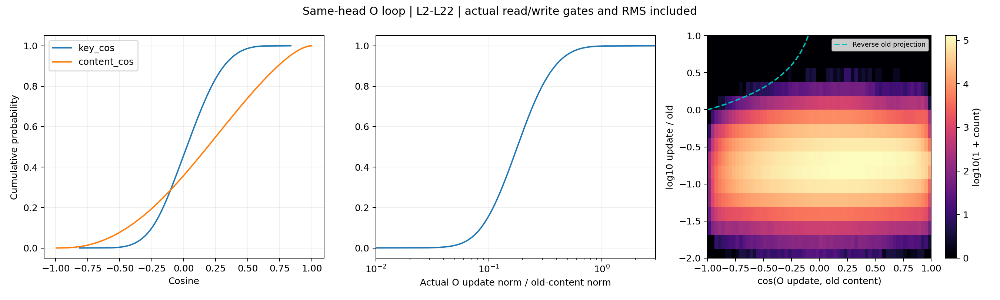

# AllLocal 四分量、写门与 local O 写回几何

**已完成：2026-09-22，checkpoint13500，128条固定 Pile 序列。诊断机按用户要求保留，不释放。**

本报告所有图表均为模型 `BamMediumIndependentLLFQKConcatStaticLocalVOSharedC8IndependentGatesK48QK48MLPPerLayerAllLocal`，训练实现 `ba299404f17b366a4e41bce5fef9306f5dfe8a17`。这是真实历史 AllLocal 实现，所有24层都是 Local，没有 fetchedO；主干的同名类只是 ledger。头、层均从0编号。

核心判断：**O通常是四项中最大的，但经实际门控和总写入RMS后，对旧记忆的同头更新通常较小；读写地址整体接近正交；写门更多关联各项幅度及组成，角度关系则明显依赖具体头。** 不能把它概括成“原地址读出后原样写回”，也不能概括成统一的“越一致越多写”。

## 1. 双门有效位置与覆盖

主分析过滤 `localO sigmoid gate >= 0.1 AND write sigmoid gate >= 0.1`，并要求 O 非零。原始记录未过滤，0.05和0.2作为敏感性检查，0阈值作为附录对照。L0零记忆夹角未定义。L1完整保存但不作为重点；L23写出的M没有后续层消费（历史 `models.py:887` 只取最终hidden carry），不能把它的写门当作中间层学到的更新策略。主汇总因此使用 **L2–L22**，所有层/头的结果仍全部保存。

先跑64条，发现双门过滤后的前半段部分头覆盖不足，再扩到128。固定前32条探索/训练，接下来的32条首轮复核，新增64条独立复核已选候选；最终预测误差报告在后96条上评估。未把同一序列内大量token当成独立样本，置信区间按序列重抽样。

L1–L23共有 **21,656,306** 个有效 `(layer,token,head)`，占该范围全部位置22.45%；其中主汇总L2–L22有 **19,287,431** 个，占21.90%。各头保留全部经验分布。用来宣称“该头有稳定关联”的最低覆盖为探索>=16条、复核>=16条、合计>=2048有效token。

| 双门门槛 | 有效位置数，L1–L23 | 满足关联覆盖的头 / 368 | 零有效位置的头 |
| --- | --- | --- | --- |
| 0.05 | 46928910 | 330 | 8 |
| 0.10 | 21656306 | 261 | 15 |
| 0.20 | 4236690 | 140 | 63 |

0.1主门槛下，满足覆盖的头从64条时238个增至128条时261个；L2–L22为231/336个。剩余稀疏头不宣称稳定规律，没有靠调低主门槛混入结论。扩样解决了部分稀疏性，不能保证所有头都经常双门同时打开。



## 2. 四部分的完整分布

四项均取被BAM注入/写入的前48维，且已经包括实际读门：

- `sv`：所有token的原始标准V经attention加权之和。
- `bam_self`：本token的BAM V乘自身attention权重。
- `bam_other`：其他token的BAM V经attention加权之和。
- `local_o`：本token直接注入的O。

下列分位数直接从全部19,287,431个有效位置合并计算，**不是各头分位数的平均**。图的CDF使用全部数据的1001个精确分位点，完整Gram原始记录可重建每个位置。

模长分布：

| 量 | P5 | P25 | P50 | P75 | P95 |
| --- | --- | --- | --- | --- | --- |
| sv | 0.8834 | 1.491 | 2.018 | 2.705 | 3.884 |
| bam_self | 0.0004091 | 0.009738 | 0.06678 | 0.3036 | 1.431 |
| bam_other | 0.02392 | 0.1567 | 0.4435 | 1.159 | 4.861 |
| local_o | 0.9648 | 2.02 | 3.144 | 4.974 | 11.23 |


各项模长除以四项模长之和的分布（**不是loss贡献占比，也不是平方能量占比**）：

| 量 | P5 | P25 | P50 | P75 | P95 |
| --- | --- | --- | --- | --- | --- |
| sv | 0.1337 | 0.2294 | 0.3093 | 0.4013 | 0.5579 |
| bam_self | 6.249e-05 | 0.00159 | 0.01053 | 0.0472 | 0.1712 |
| bam_other | 0.004351 | 0.02861 | 0.0736 | 0.1642 | 0.4067 |
| local_o | 0.2333 | 0.3858 | 0.5163 | 0.6489 | 0.808 |


四项分别成为模长最大项的比例为 **sv 21.12%、bam_self 0.76%、bam_other 6.75%、local_o 71.37%**。selfBAM在79.61%的位置是最小项。因此“localO通常最大、selfBAM通常最小”的下注成立，但不是所有层/头都如此。

六对余弦分布：

| 量 | P5 | P25 | P50 | P75 | P95 |
| --- | --- | --- | --- | --- | --- |
| sv__bam_self | -0.4278 | -0.2178 | -0.08263 | 0.04766 | 0.2405 |
| sv__bam_other | -0.5471 | -0.3253 | -0.1657 | -0.01057 | 0.2238 |
| sv__local_o | -0.4278 | -0.2178 | -0.08263 | 0.04766 | 0.2405 |
| bam_self__bam_other | -0.217 | 0.09361 | 0.3148 | 0.5585 | 0.8465 |
| bam_self__local_o | 1 | 1 | 1 | 1 | 1 |
| bam_other__local_o | -0.217 | 0.09361 | 0.3148 | 0.5585 | 0.8465 |


`bam_self` 与 `local_o` 同向共线是此配置的结构事实：共享同一个未门控读出，仅乘不同正读门与非负self-attention系数。它不是数据发现。因而六个夹角中有重复信息；预测模型仅保留三个不同的方向关系，排除固定共线角及重复角。模长仍有四个不同系数。

更值得注意的是：**标准V与BAM项略偏反向，其他token的BAM V与本地O偏同向，但两者都有宽分布。** localO/otherBAM的余弦P5/P50/P95为−0.217/0.315/0.846，不能用“都正交”或“都同向”代替真实分布。





## 3. 几何与写门：幅度重要，但不能压缩成一个总模长

按层建模，基线仅使用头身份和token位置，加入几何量后比较后96条序列的均方预测误差。每序列每头随机抽至多128个符合过滤条件的token用于模型，完整分布不抽样。读门控制模型还加入localV/O读门，避免将几个门同步变化全部误读为内容几何信息。

L2–L22各层误差改善的中位数：

| 加入的变量 | 相对头身份/位置基线，留出MSE降低 |
| --- | --- |
| 总写入向量模长一个量 | 13.98% |
| 四项绝对模长 | 27.67% |
| 四项模长占比 | 22.25% |
| 三个不同的夹角关系 | 8.93% |
| 全部几何，包括相干程度和self alpha | 30.70% |


再控制两个读门后，几何仍降低剩余预测误差的层间中位数为 **21.83%**。全部几何在21个普通层均超过15%的误差改善，事前“至少一半层超过15%”的下注成立。模长模型与完整模型有时接近，甚至个别层略好，因此不能说每层都必须加夹角。

这给出两个不同判断：**幅度信息比单纯角度更普遍；但“分别是哪一项强”又比“总和强不强”更有信息。** 这些是关联与预测结论；当前写门从x计算，并不直接观察这些向量，所以不能据此宣称模型显式执行某个几何判据。



### 不同头有相反而可复现的规律

所有幅度、占比、不同夹角、相干程度、self alpha都作了探索，不优先用户举例的方向。按前32条的头内Spearman绝对值>=0.3筛选候选，剔除结构重复角，共562个候选关联；新增64条中556个同号且绝对值>0.2。它们相互相关，**不是562个独立机制，也不是因果发现**。6个减弱的候选也保存在 `research_summary.json`，没有删掉失败项。

下面的规律先在原64条中提出，再用新增64条复核。低/高组均为前32条固定的第一/第八几何分位组；写门数值是新增64条的组内均值，图另显示完整条件分布的中位数和10–90%范围。

| 层/头 | 几何量增加 | 探索ρ | 新增64条ρ | 新增64条写门：低组→高组 |
| --- | --- | --- | --- | --- |
| L18-H15 | lognorm_sv | 0.739 | 0.736 | 0.250 → 0.753 |
| L15-H12 | lognorm_bam_other | 0.752 | 0.736 | 0.293 → 0.801 |
| L4-H12 | share_local_o | 0.679 | 0.665 | 0.132 → 0.230 |
| L18-H4 | share_local_o | -0.613 | -0.689 | 0.544 → 0.204 |
| L15-H12 | cos_bam_other__local_o | 0.570 | 0.543 | 0.323 → 0.711 |
| L16-H12 | cos_bam_other__local_o | -0.575 | -0.555 | 0.710 → 0.441 |


最有判别力的是两组反例：

1. localO占比提高，L4-H12更愿意写，L18-H4反而减少写。后者的主要下降发生在localO占比约0.26–0.39一带，但条件分布仍宽，不能当作确定开关。
2. otherBAM与localO越同向，L15-H12写门增大，L16-H12写门减小。两头在0、0.05、0.1、0.2门槛下符号均保持；控制token位置后也保持。

所以 **“越同向就越开门”不是跨头规律；“localO越占主导就越开门”也不是。** 原始V绝对幅度通常正相关，但它的模长占比经常负相关，绝对幅度和相对占比不能互换。



## 4. localO读出地址与写回地址：接近正交，不是原地址回写

M为48×32，压缩投影P为32×8。使用实际读键处理后的q，经 **r=Pq** 提升至完整M的32维地址空间，再与实际归一化写地址p计算同头夹角。不能直接比较C8键与32维写地址。

| 分位数 | P5 | P25 | P50 | P75 | P95 |
| --- | --- | --- | --- | --- | --- |
| 夹角/度 | 66.98 | 79.63 | 88.63 | 97.27 | 108.62 |
| cos(r,p) | -0.3193 | -0.1266 | 0.0238 | 0.1801 | 0.3910 |


**夹角中位数88.63°，中间90%为66.98°–108.62°。** 62.71%的位置满足 `abs(cos(r,p))<0.2`，即约78.46°–101.54°。这是合并位置分布，不代表每个头都恰好90°；右图按头给出中位数，不满足关联覆盖的稀疏头留白。



地址接近正交不意味着内容接近正交：**cos(Mr,Mp)的中位数是0.1867**，P5/P95为−0.5845/0.8296。约 **30.23%** 的位置，地址余弦和内容余弦符号不同。M的映射改变了几何关系；是否抵消旧内容必须看内容空间，不能只看两个键。

## 5. 实际O写回有多大：反向常见，过量抵消极少

用原始前向的总写入data RMS分母，将O分量分摊为：

`wO = write_gate × local_o / sqrt(mean(actual_total²) + 1e-6)`。

实际同头O矩阵更新为 `wO pᵀ`。在单位地址 `p_hat=p/||p||` 处，旧内容为 `M p_hat`，O更新为 `wO ||p||`。因此比较的模长比 **ρ=||wO||·||p|| / ||M p_hat||** 已包含读门、写门、data RMS和外积地址幅度；没有漏掉p的模长。

| 量 | P5 | P25 | P50 | P75 | P95 |
| --- | --- | --- | --- | --- | --- |
| 旧内容 ||M p_hat|| | 18.03 | 29.3 | 39.45 | 50.91 | 74.68 |
| 实际同头O更新 ||wO||·||p|| | 2.783 | 4.541 | 6.705 | 10.37 | 18.97 |
| 实际更新/旧内容 ρ | 0.06977 | 0.1205 | 0.179 | 0.2681 | 0.4786 |
| 更新与旧内容cos | -0.5845 | -0.1586 | 0.1867 | 0.511 | 0.8296 |
| 沿旧方向的相对更新 ρcos | -0.1209 | -0.02441 | 0.02884 | 0.09299 | 0.2197 |


**实际O更新/旧内容的中位数为0.179，P5–P95为0.070–0.479。** 大多数情况下它只是旧内容幅度的一部分。尽管O在四项中往往最大，也不意味着一次O写回足以主导M。

| 同头O分量相对旧内容的情况 | 占有效位置比例 | 按独立序列bootstrap 95%区间 |
| --- | --- | --- |
| 同向分量，加强原方向 | 64.142731% | [63.752517%, 64.551262%] |
| 反向分量，抵消原方向 | 35.857269% | [35.478671%, 36.266930%] |
| ρcos < −1，超过旧内容原方向幅度 | 0.000093% | [0.000042%, 0.000147%] |
| 仅ρ > 1，更新模长超过旧内容 | 0.128384% | [0.118972%, 0.137982%] |


L2–L22共 **18 / 19,287,431** 个位置满足 `ρcos < −1`，约百万分之一；反向位置则占35.86%。两者不是一回事。负cos仅表示旧内容方向上的抵消，并不自动等于M总范数降低；`负cos且ρ>1`也不是原方向被反转的充分条件。本报告没有做用户排除的全M能量或跨头分析。

0.05/0.10/0.20门槛下，反向比例约39.81%/35.86%/30.88%，过量抵消均是百万分之几以下。门槛会改变样本人群，不能将这个比例变化直接解读成门的因果作用。



这些量是**实际前向的同头O分量分解**。分母固定为实际四项总写入RMS；不是删除O后重新归一化的因果消融，也不代表其他分量和其他头一起更新后的总效果。

## 6. 更新后的理解与最值得验证的下一步

当前证据支持这样理解这个回环：localO把读出的内容带入o_head，常占较大幅度；随后沿一个通常不同于读地址的p写回。写入位置的旧内容与它可能同向，也可能反向；经实际归一化和门控后的更新通常较小。这更像**把读到的内容在另一地址处作有限幅度的再写入/修正**，不支持普遍的原位自我放大图景。“修正”是几何描述，不等于已经证明其功能收益。

几何与写门的规律有明显头特异性，且四项幅度比单个总模长更有预测力。若据此考虑改进，最值得检验的是**让写门获得分量级强度信息是否有收益**，保留每头独立的判断，不能硬编码统一的夹角正负规则。对照应保持训练预算一致，并比较同样的M-cache成本；若显式几何门并不改善loss，说明当前x门已足够，或这些关联只是共同输入造成的相关性。这个训练实验尚未做，本次只完成诊断。

更近一步、判别力更强的因果问题是：L15-H12偏同向开门和L16-H12偏冲突开门，是否分别承担传播与修正的作用？可在后续只干预写回中的O方向，固定实际读出/残差路径和写入尺度，在匹配门开度的位置比较loss。若两类头对方向干预没有预期的相反敏感性，应放弃这个功能解释。**本次未执行这些新增干预。**

## 7. 下注复核

事前协议保存在主仓库commit `2df9eb34`，以下预测在采集前固定：

1. 非普遍正交，otherBAM/O同向与冲突都有；localO往往最大、selfBAM通常最小。分布和71.37%最大比例支持。
2. 层/头内部存在稳定几何关联，组合特征优于任意单角，至少半数普通层改善剩余预测误差15%。21个普通层均超过15%；幅度胜于角度、符号依头而异的具体结果来自数据，非事前假定。
3. 同头O写回以加强或轻度抵消为主，过量抵消<1%。成立，而且实测比下注上限低得多。不能把“反向占35.86%”误报成大规模擦除。

## 8. 数值验证、产物与复现

- 原始前向不改：128条逐序列普通前向与带采集前向的loss **全部完全一致**。历史BAM单测57项、实际BamAttention采集不改输出测试、实际O写入公式测试均通过。
- 模型源码 `MaxText/` 相对训练commit无改动。Flax方法拦截采集；原始attention与write返回值原样返回。诊断分解用FP32；真实模型仍使用历史BF16路径。
- 四项和相对实际o_head的重建误差，各层中最差中位数0.281%、P99 0.443%，全位置最大1.746%。提升读键后重建未门控读出的相应值为0.314%、0.798%、2.106%。这些是BF16/FP32路径差异，未宣称每个诊断向量逐位完全相同。
- 先用64条，扩到128条；T2048、seed9876、固定cohort SHA256 `68239ae352be31f968984c18a2a7e3290cdbfb665f350563aad6ff77eea84661`。同一份cohort未重抽样。
- TPU为v6e-1，worker44核CPU。采集与4线程落盘流水，分析24进程、各数值库单线程。128条同两层串行23.923秒/双进程16.867秒，加速1.418倍，数值相同；全量精确合并分位数用12线程，用时9.10秒。修复过`OMP_NUM_THREADS=1`影响`nproc`导致初次误开单进程的问题，最终使用CPU affinity确定24进程。
- 128个原始数组，每个24×2048×16×27，合计 **10,871,652,352字节**；本机/GCS数量和大小一致，所有shape验证通过。见 `artifact_verification.json`。保存全部位置的10个Gram上三角元素及门、键角、实际更新指标等，不仅保存均值。

checkpoint：`gs://newproject-1-llm_projects_us-east5/log/BamMediumIndependentLLFQKConcatStaticLocalVOSharedC8IndependentGatesK48QK48MLPPerLayerAllLocal/checkpoints/13500/items`。

实现worktree `/data0/xd/alllocal-write-geometry`，分支 `codex/alllocal-write-geometry`。首64条采集runtime `5569f4ce`；新增64条 `c8c106a2`，采集与模型代码相同；最终排除重复夹角的模型分析 `0f88c653`。最终绘图脚本commit `1b25d71f`，不改变采集张量。

入口脚本均在该worktree `experiments/bam_llama2_medium/`：`write_geometry.py`、`analyze_write_geometry.py`、`explore_write_geometry.py`、`exact_population_write_geometry.py`、`extract_write_geometry_bins.py`、`report_write_geometry.py`、`run_write_geometry.sh`。主要复现命令：

```bash
GEOMETRY_N=128 GEOMETRY_OUTPUT=<worker-output> GEOMETRY_GCS=<gcs-output> bash experiments/bam_llama2_medium/run_write_geometry.sh
python experiments/bam_llama2_medium/explore_write_geometry.py <worker-output> --workers 24
python experiments/bam_llama2_medium/exact_population_write_geometry.py <worker-output>
python experiments/bam_llama2_medium/extract_write_geometry_bins.py <worker-output> <report-output>
python experiments/bam_llama2_medium/report_write_geometry.py <report-output>
```

绘图目录需有同一轮的 `analysis_gate000/005/010/020`、`exploration`、`pooled_exact.npz` 和固定探索分箱 `example_bin_values.json`。`per_layer_head_quantiles.csv`包含每层每头的四项几何与同头读写指标；NPZ另含完整二维直方图、逐序列条件曲线、独立样本覆盖，原始Gram可进一步重算。

本机根目录 `/data0/xd/bam_diagnostics/alllocal-write-geometry-13500-0922`：`worker/`为原始记录，`review/`为首64条快照，`final128/`为最终分布、图、表及研究摘要。GCS根目录 `gs://newproject-1-llm_projects_europe-west4/log/diagnostics/alllocal-write-geometry-13500-0922`。

**保留的诊断机：`xd-v6e-alllocal-geom-3-0922`，`europe-west4-a`，项目`newproject-1-451205`。** 用户明确要求诊断完不要释放，覆盖默认清理流程；`resources.json`与`KEEP_DIAGNOSTIC_MACHINE`已记录。没有为此要求额外确认。
